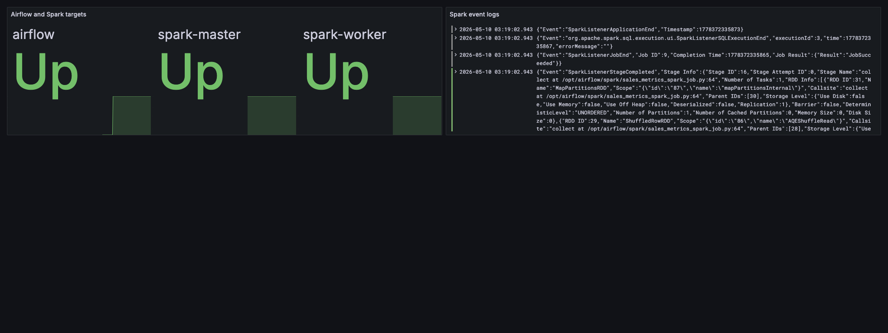

# ЛР 4. Loki + Prometheus + Grafana

## Скриншот Grafana

Dashboard `DevOps homework / Lab 4 Observability` содержит две панели:

- состояние targets `airflow`, `spark-master`, `spark-worker` из Prometheus;
- Spark event logs из Loki.

## Новые конфиги

- `alloy.conf`
- `prometheus.yml`
- `spark/metrics.properties`
- `grafana/provisioning/datasources/datasources.yml`
- `grafana/provisioning/dashboards/dashboards.yml`
- `grafana/dashboards/lab4-observability.json`
